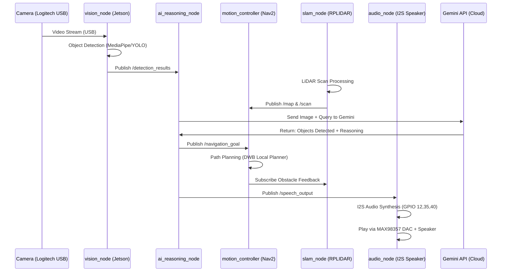

<h1 align="center">🤖 GEMBOT: AI COMPANION ROBOT WITH ROS 2 & GEMINI 🤖</h1>

<p align="center">
  
</p>

<p align="center">
  <em>Robot pendamping otonom berbasis roda yang mengintegrasikan ROS 2 Humble, Jetson Nano AI Vision, RPLIDAR SLAM, dan kecerdasan multimodal Gemini AI.</em>
</p>

<p align="center">
  
  
  
  
  
  
</p>

---

## 📋 Daftar Isi

- [Tentang Gembot](#-tentang-gembot)
- [Fitur Utama](#-fitur-utama)
- [Arsitektur Sistem](#-arsitektur-sistem)
- [Spesifikasi Hardware](#-spesifikasi-hardware)
- [Software Stack](#-software-stack)
- [Integrasi Gemini AI](#-integrasi-gemini-ai)
- [Konfigurasi I2S Audio (MAX98357)](#-konfigurasi-i2s-audio-max98357)
- [Instalasi](#-instalasi)
- [Cara Menjalankan](#-cara-menjalankan)
- [Testing & Troubleshooting](#-testing--troubleshooting)
- [Pengembang](#-pengembang)
- [Lisensi](#-lisensi)

---

## 🚀 Tentang Gembot

**Gembot** adalah proyek robot riset otonom dari Lab AI Universitas Cendekia Abditama. Nama Gembot diambil dari perpaduan **Gemini** (otak AI-nya) dan **Robot**. Gembot dirancang untuk menjadi asisten laboratorium yang mampu:

- Memetakan ruangan 360° menggunakan LiDAR SLAM
- Mengenali objek dan wajah via AI Vision (Gemini Pro Vision)
- Berinteraksi secara verbal dengan Speech-to-Text dan Text-to-Speech
- Beroperasi mandiri dengan konektivitas 4G LTE
- Mengelola daya dengan aman menggunakan monitoring tegangan real-time

---

## ✨ Fitur Utama

| Fitur | Deskripsi |
|-------|-----------|
| **🗺️ 360° LiDAR SLAM** | Memetakan ruangan real-time menggunakan RPLIDAR A1 (USB) |
| **👁️ Multimodal AI Vision** | Identifikasi objek & wajah via Gemini Pro Vision API |
| **🎤 Natural Interaction** | Speech-to-Text + Text-to-Speech via I2S DAC MAX98357 |
| **🌐 Wireless Autonomy** | Terkoneksi internet mandiri via Andromax M3Z 4G LTE MiFi |
| **⚡ Safe Power Management** | Li-ion 3S dengan Low Voltage Cutoff (LVC) & Buck Converter stabil |
| **🔄 Real-time ROS 2 Communication** | DDS/UDP untuk latency rendah antar node (< 20ms) |
| **🎯 Obstacle Avoidance** | Navigasi adaptif dengan sensor feedback dari LiDAR |

---

## 🏗️ Arsitektur Sistem

### Diagram Blok Topologi v2.0

```
┌──────────────────────────────────────────────────────────────┐
│                    GEMBOT SYSTEM TOPOLOGY                    │
└──────────────────────────────────────────────────────────────┘

┌─────────────────────────────────────────────────────────────┐
│              JETSON NANO 2GB (ROS 2 Humble)                 │
│  ┌──────────────────────────────────────────────────────┐   │
│  │  Node: vision_node (MediaPipe/YOLO Object Detect)    │   │
│  │  Node: ai_reasoning_node (Gemini API Integration)    │   │
│  │  Node: motion_controller (Nav2 + DWB Local Planner)  │   │
│  │  Node: slam_node (RPLIDAR Processing & Map Build)    │   │
│  │  Node: audio_node (I2S Speech Synth/Recognition)     │   │
│  └──────────────────────────────────────────────────────┘   │
└──────────────┬──────────────────┬────────────────┬──────────┘
               │                  │                │
        USB Port 1          USB Port 2         USB Port 3
        (RPLIDAR)          (WiFi 5 Adapter)   (Webcam)
               │                  │                │
    ┌──────────▼─────────────────▼────────────────▼──────────┐
    │           PERIPHERAL CONNECTIONS (USB)                 │
    │  • RPLIDAR A1 (360° Scanner @ 25KHz)                   │
    │  • Logitech C270 HD Webcam (1280x720@30fps)            │
    │  • ASUS WiFi 5 USB Adapter                             │
    └──────────────────────┬─────────────────────────────────┘
                           │
            ┌──────────────┴───────────────┐
            │                              │
    ┌───────▼────────────┐        ┌───────▼───────────┐
    │  Andromax M3Z MiFi │        │  Lab WiFi Router  │
    │  (4G LTE / WiFi)   │        │  (Wireless Link)  │
    └────────────────────┘        └───────────────────┘
            │                              │
            └──────────────┬───────────────┘
                           │
            ┌──────────────▼──────────────┐
            │  Internet (Cloud Services)  │
            │  - Gemini AI API            │
            │  - Cloud Storage (Optional) │
            └─────────────────────────────┘

    ┌─────────────────────────────────────────────────────────┐
    │           I2S AUDIO INTERFACE (Jetson GPIO)             │
    │  LRCLK (L/R Clock) → Pin 35                             │
    │  BCLK  (Bit Clock) → Pin 12                             │
    │  DIN   (Data In)   → Pin 40                             │
    │                                                         │
    │  Connected to: MAX98357 I2S DAC + 3W Speaker            │
    │  Purpose: Audio Output for Voice Synthesis              │
    └─────────────────────────────────────────────────────────┘

    ┌──────────────────────────────────────────────────────────┐
    │          MOTOR CONTROL & POWER DISTRIBUTION              │
    │  ┌───────────────────────────────────────────────────┐   │
    │  │  HIGH POWER CIRCUIT:                              │   │
    │  │  • 12V Direct → L298N Motor Driver (with Fuse)    │   │
    │  │  • 4x DC Gearbox Motors (Yellow Motor)            │   │
    │  └───────────────────────────────────────────────────┘   │
    │  ┌───────────────────────────────────────────────────┐   │
    │  │  STABLE POWER CIRCUIT (COMMON GROUND):            │   │
    │  │  • 5V 5A from LY-KREE Buck Converter              │   │
    │  │  • Supplies: Jetson Nano, Sensors, L298N Logic    │   │
    │  │  • Single Reference Ground (GND)                  │   │
    │  └───────────────────────────────────────────────────┘   │
    │  ┌───────────────────────────────────────────────────┐   │
    │  │  POWER SOURCE:                                    │   │
    │  │  • Li-ion 18650 3S Pack (11.1V, 8000mAh)          │   │
    │  │  • Protection Circuit (Overcharge/LVC)            │   │
    │  │  • MiFi Power: Separate power bank or USB         │   │
    │  └───────────────────────────────────────────────────┘   │
    └──────────────────────────────────────────────────────────┘
```

### Alur Data ROS 2



---

## 🧩 Spesifikasi Hardware

| Komponen | Spesifikasi | Catatan |
|----------|-------------|---------|
| **Compute Unit** | NVIDIA Jetson Nano 2GB (ARM Cortex-A57) | JetPack 4.6+, Ubuntu 20.04 LTS |
| **Laser Scanner** | RPLIDAR A1/A2 (USB) | 360° LiDAR, 25KHz Sampling, ~5m Range |
| **Vision Sensor** | Logitech C270 USB Webcam | 1280x720 @ 30fps, H.264 |
| **Audio Output** | MAX98357 I2S DAC | Amplifier 3W @ 4Ω, Gain 9dB |
| **Speaker** | 3W passive speaker | Connected via MAX98357 |
| **Motor Driver** | L298N Dual H-Bridge | Dual Channel PWM, 2A per channel |
| **Motors** | 4x DC Gearbox Motor (Yellow) | 6-12V, ~100 RPM gear ratio |
| **Power Source** | Li-ion 18650 3S Pack | 11.1V nominal, 8000mAh capacity |
| **Buck Converter** | LY-KREE 12V→5V | 5A output, adjustable via potentiometer |
| **Wireless (WiFi)** | ASUS USB WiFi 5 Adapter | 2.4/5GHz dual-band |
| **Wireless (LTE)** | Andromax M3Z MiFi | 4G LTE → WiFi Bridge |
| **Protective Circuit** | 3S LiPo Protection Board | Overcharge/Over-discharge protection |

---

## 💻 Software Stack

### Pada Jetson Nano

| Software | Version | Fungsi |
|----------|---------|--------|
| **OS** | Ubuntu 20.04 LTS | Base system |
| **ROS 2** | Humble Hawksbill | Middleware robotika |
| **Python** | 3.8+ | Node implementation |
| **OpenCV** | 4.5+ | Image processing |
| **MediaPipe** | Latest | Hand/pose/object detection |
| **RPLIDAR SDK** | Latest | LiDAR communication |
| **Gemini AI SDK** | Latest | Google Generative AI |
| **Navigation2** | ros2-humble | SLAM & Path planning |
| **colcon** | Latest | ROS 2 build tool |
| **rviz2** | Latest | 3D visualization |
| **PulseAudio / ALSA** | Latest | I2S Audio interface |

### ROS 2 Packages Custom

| Package | Node | Fungsi |
|---------|------|--------|
| **gembot_bringup** | gembot_launch.py | Launch semua nodes |
| **gembot_vision** | vision_node | MediaPipe + YOLO object detection |
| **gembot_ai** | ai_reasoning_node | Gemini API integration |
| **gembot_navigation** | motion_controller | Nav2 + obstacle avoidance |
| **gembot_slam** | slam_node | RPLIDAR SLAM processing |
| **gembot_audio** | audio_node | I2S speech synthesis/recognition |

---

## 🧠 Integrasi Gemini AI

Gembot mengintegrasikan **Google Gemini Flash 1.5** untuk reasoning multimodal:

### Flow Interaksi AI

1. **Input Multimodal**
   - Camera frame dari Logitech USB
   - Jarak & map dari RPLIDAR
   - Query teks atau speech recognition

2. **Processing** (Jetson Nano)
   ```
   ai_reasoning_node:
   ├─ Subscribe /detection_results (vision)
   ├─ Subscribe /map (SLAM)
   ├─ Compose prompt dengan konteks
   └─ Call Gemini API (via 4G MiFi)
   ```

3. **Gemini Decision**
   - Analisis gambar real-time
   - Reasoning logis berdasarkan konteks
   - Output: Navigation goal, objek terdeteksi, respon percakapan

4. **Execution** (ROS 2 Topics)
   ```
   Publish /motion_cmd → motion_controller
   Publish /speech_output → audio_node (I2S)
   ```

### API Configuration

```yaml
# Stored in: ~/gembot_ws/src/gembot_ai/config/gemini_config.yaml
gemini_api_key: "YOUR_API_KEY_HERE"
model: "gemini-1.5-flash"
temperature: 0.3  # Lower = more deterministic
max_tokens: 1024
timeout_seconds: 10
```

---

## 🔊 Konfigurasi I2S Audio (MAX98357)

### Hardware Wiring (40-pin GPIO Header)

| MAX98357 Pin | Jetson Nano Pin | GPIO Function | Keterangan |
|--------------|-----------------|---------------|-----------|
| **Vin** | Pin 2 atau 4 (5V) | Power | Ambil dari buck converter 5V |
| **GND** | Pin 6, 9, atau 14 | Ground | Reference tegangan |
| **LRCLK** | Pin 35 | I2S_FS (Frame Sync) | Menentukan channel L/R |
| **BCLK** | Pin 12 | I2S_SCLK (Bit Clock) | Sinkronisasi data |
| **DIN** | Pin 40 | I2S_SDATA (Data) | Jalur audio digital |
| **GAIN** | Floating | - | Default 9dB (sudah cukup) |
| **SD** | Floating | - | Selalu aktif (Shutdown high) |

### Aktivasi I2S pada Jetson Nano

```bash
# Buka Jetson-IO configuration tool
sudo /opt/nvidia/jetson-io/jetson-io.py

# Di menu, pilih:
# 1. Configure 40-pin expansion header
# 2. Cari dan centang: i2s4
# 3. Save and reboot

# Verifikasi setelah reboot
aplay -l  # Harus muncul "tegra-hda-i2s" atau device baru
```

### Testing Audio Output

```bash
# Generate test tone
speaker-test -t sine -f 1000 -l 1

# Play WAV file via I2S
aplay -D hw:tegrahdai2s /path/to/test.wav

# ROS 2 Audio Node Subscribe
ros2 topic pub /speech_output std_msgs/msg/String "data: 'Hello World'"
```

---

## ⚙️ Instalasi

### 1. Clone Repository

```bash
git clone https://github.com/ficrammanifur/gembot-ros2-ai.git
cd gembot-ros2-ai
```

### 2. Setup Jetson Nano

#### Install ROS 2 Humble

```bash
# Update locale
sudo apt update && sudo apt install locales
sudo locale-gen en_US en_US.UTF-8
sudo update-locale LC_ALL=en_US.UTF-8 LANG=en_US.UTF-8
export LANG=en_US.UTF-8

# Setup ROS 2 repository
sudo apt install software-properties-common
sudo add-apt-repository universe
sudo apt update && sudo apt install curl -y
sudo curl -sSL https://raw.githubusercontent.com/ros/rosdistro/master/ros.key -o /usr/share/keyrings/ros-archive-keyring.gpg

echo "deb [arch=$(dpkg --print-architecture) signed-by=/usr/share/keyrings/ros-archive-keyring.gpg] http://packages.ros.org/ros2/ubuntu $(. /etc/os-release && echo $UBUNTU_CODENAME) main" | sudo tee /etc/apt/sources.list.d/ros2.list > /dev/null

# Install ROS 2 Humble
sudo apt update
sudo apt install ros-humble-desktop -y
sudo apt install ros-dev-tools -y
```

#### Setup ROS 2 Workspace

```bash
# Source ROS 2
source /opt/ros/humble/setup.bash
echo "source /opt/ros/humble/setup.bash" >> ~/.bashrc

# Create workspace
mkdir -p ~/gembot_ws/src
cd ~/gembot_ws

# Clone project
cd src
git clone https://github.com/ficrammanifur/gembot-ros2-ai.git .

# Install Python dependencies
pip3 install opencv-python mediapipe google-generativeai pyaudio numpy pandas

# Build workspace
cd ~/gembot_ws
colcon build
source install/setup.bash
echo "source ~/gembot_ws/install/setup.bash" >> ~/.bashrc
```

#### Konfigurasi Gemini API Key

```bash
# Edit config file
nano ~/gembot_ws/src/gembot_ai/config/gemini_config.yaml

# Add your API key
gemini_api_key: "your-gemini-api-key-here"
jetson_ip: "192.168.1.10"
rplidar_port: "/dev/ttyUSB0"
```

### 3. Konfigurasi I2S Audio

```bash
# Aktifkan I2S4 via jetson-io
sudo /opt/nvidia/jetson-io/jetson-io.py
# Pilih: Configure 40-pin expansion header → i2s4 → Save and reboot

# Setelah reboot, pastikan ALSA dapat detect
aplay -l  # Harus ada "tegra-hda-i2s"

# Install audio tools
sudo apt install alsa-utils pulseaudio libttspico-utils -y
```

---

## 🚀 Cara Menjalankan

### 1. Start Core Services

```bash
# Terminal 1: Jetson Nano
cd ~/gembot_ws
source install/setup.bash

# Launch semua nodes
ros2 launch gembot_bringup gembot_launch.py
```

Expected output:
```
[INFO] [gembot_launch.py]: Starting Gembot system...
[INFO] [vision_node]: Camera initialized (Logitech C270)
[INFO] [slam_node]: RPLIDAR initialized at /dev/ttyUSB0
[INFO] [ai_reasoning_node]: Gemini API connected
[INFO] [motion_controller]: Nav2 initialized
[INFO] [audio_node]: I2S audio interface ready
[INFO] [gembot_launch.py]: All nodes started successfully!
```

### 2. Verify ROS 2 Communication

```bash
# Check active nodes
ros2 node list

# Expected:
# /vision_node
# /slam_node
# /ai_reasoning_node
# /motion_controller
# /audio_node

# Check active topics
ros2 topic list

# Expected:
# /detection_results
# /map
# /navigation_goal
# /obstacle_distance
# /speech_output
# /scan
```

### 3. Test Vision & AI

```bash
# Terminal 2: Monitor detections
ros2 topic echo /detection_results

# Terminal 3: Send test query
ros2 topic pub /ai_query std_msgs/msg/String \
  "data: 'Apa yang terlihat di depanmu?'"

# Expected response via /speech_output topic
```

### 4. Test Motion Control

```bash
# Publish navigation goal
ros2 topic pub /navigation_goal geometry_msgs/msg/PoseStamped \
  "{header: {frame_id: 'map'}, pose: {position: {x: 1.0, y: 0.0, z: 0.0}}}"

# Robot akan navigasi ke target
```

### 5. Visualize dengan Rviz2

```bash
# Di PC/Remote
ros2 launch gembot_bringup rviz_launch.py

# Atau manual launch
rviz2 -d ~/gembot_ws/src/gembot_bringup/config/gembot.rviz
```

---

## 🧪 Testing & Troubleshooting

### Test I2S Audio Output

```bash
# Generate test tone (1 detik, 1kHz sine wave)
speaker-test -t sine -f 1000 -l 1

# Play test file
aplay /path/to/test.wav

# Check audio device
aplay -l
alsamixer  # Adjust volume jika perlu
```

### Test RPLIDAR

```bash
# Check RPLIDAR connection
ls -la /dev/ttyUSB*

# Run RPLIDAR node standalone
ros2 run rplidar_ros rplidar_composition --ros-args -p serial_port:=/dev/ttyUSB0

# Monitor scan data
ros2 topic echo /scan
```

### Test Gemini API

```bash
# Test API connection
python3 << 'EOF'
import google.generativeai as genai
genai.configure(api_key="YOUR_API_KEY")
model = genai.GenerativeModel("gemini-1.5-flash")
response = model.generate_content("Hello, Gemini!")
print(response.text)
EOF
```

### Common Issues & Solutions

| Issue | Solusi |
|-------|--------|
| **I2S device not detected** | Run `jetson-io` again, pastikan i2s4 diaktifkan |
| **RPLIDAR no permissions** | `sudo usermod -a -G dialout $USER` then reboot |
| **Gemini API timeout** | Check WiFi/4G connection, verify API key valid |
| **ROS 2 nodes tidak connect** | `ros2 daemon stop && ros2 daemon start` |
| **Audio crackling** | Kurangi volume di `alsamixer`, check power supply |

---

## 👨‍💻 Pengembang

**Ficram Manifur Farissa**

- 🎓 Final Year Electrical Engineering Student
- 💻 GitHub: [@ficrammanifur](https://github.com/ficrammanifur)
- 📧 Email: ficrammanifur@example.com

---

## 📄 Lisensi

Proyek ini dilisensikan di bawah [MIT License](LICENSE).

---

<div align="center">
  <strong>"Gembot - Bringing Gemini AI to the Physical World"</strong><br>
  Built with ❤️ in Lab AI UCA<br>
  <br>
  
</div>
